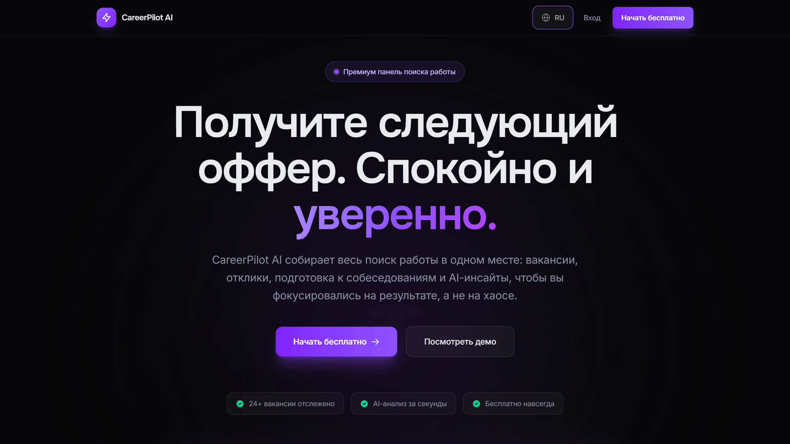
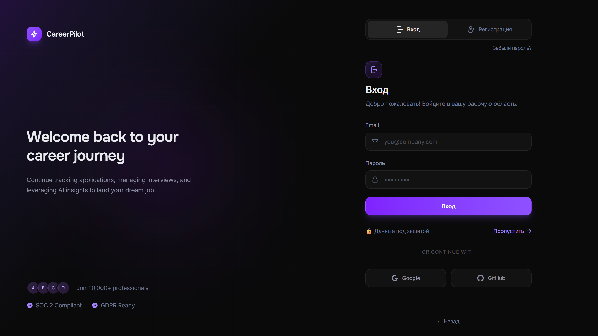
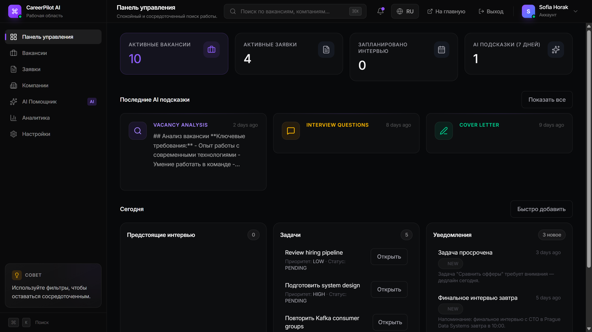
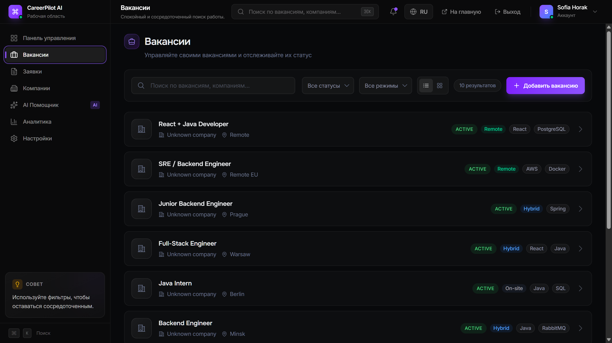
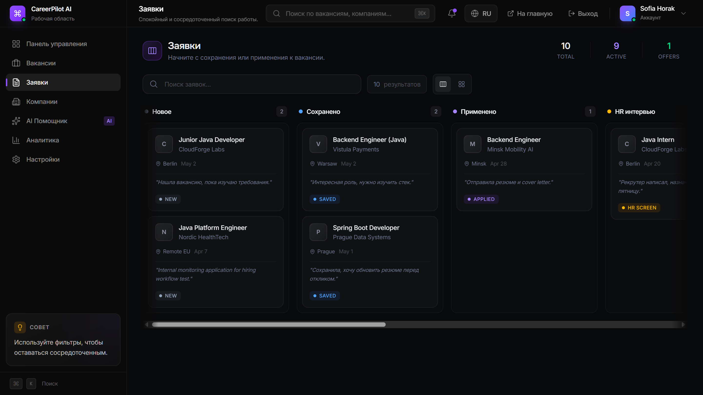
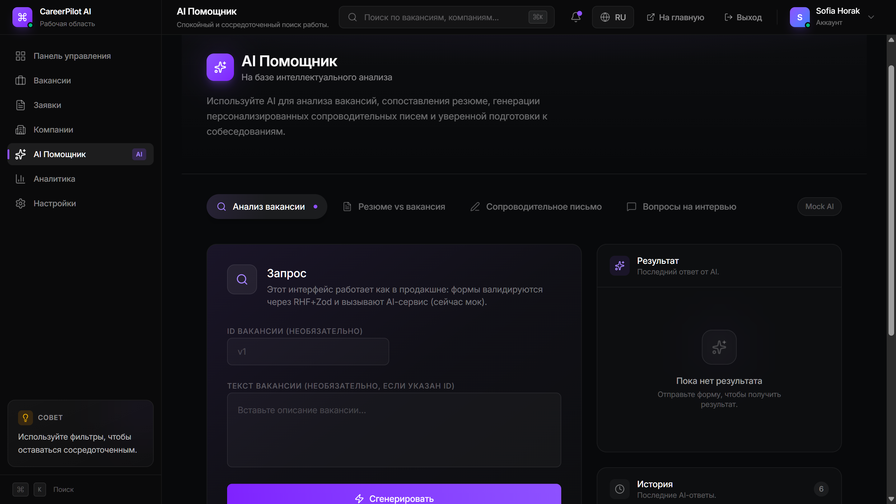
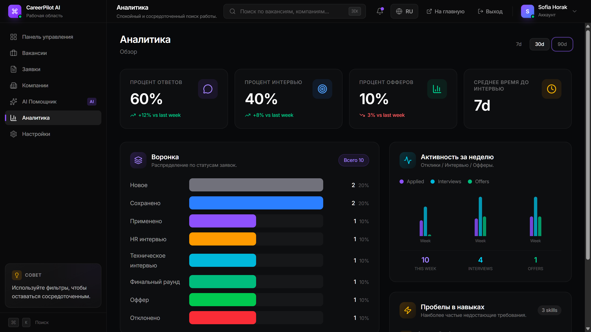

# CareerPilot AI

<div align="center">

**Управление поиском работы как структурированным workflow — с AI-ассистентом, Kanban-бордом и аналитикой.**

[](https://careerpilot-ai-sigma.vercel.app)
[](https://github.com/AlexanderPolozhnov/careerpilot-ai/releases)
[](https://openjdk.org/)
[](https://spring.io/projects/spring-boot)
[](https://react.dev/)

> **Статус:** В активной разработке · Portfolio project с production-like архитектурой · Не production-ready

</div>

---

## 🖼️ Скриншоты

### Лендинг



---

### Авторизация



---

### Dashboard



---

### Вакансии — детальная страница



---

### Отклики — Kanban-борд



---

### AI-ассистент



---

### Аналитика



---

## 🚀 Live Demo

**[careerpilot-ai-sigma.vercel.app](https://careerpilot-ai-sigma.vercel.app)**

Demo-аккаунт для входа:

| Поле   | Значение               |
|--------|------------------------|
| Email  | `sofia.horak@demo.dev` |
| Пароль | `Demo123!@#`           |

> ⚠️ Live demo работает в режиме **mock data** — backend не подключён к Vercel-деплою.
> Данные сбрасываются при перезагрузке страницы, изменения не сохраняются.
> Для полного функционала с PostgreSQL — локальный запуск (см. ниже).

---

## О проекте

Поиск работы быстро превращается в набор разрозненных вкладок, таблиц, заметок и напоминаний.
CareerPilot AI собирает этот процесс в один понятный workflow:

- хранение вакансий и компаний;
- отслеживание этапов откликов через Kanban-борд с drag-and-drop;
- AI-анализ вакансий, сравнение резюме, генерация cover letter и вопросов к интервью;
- аналитика прогресса поиска работы;
- интерфейс на русском и английском.

---

## ✅ Что реализовано

### Backend (REST API)

| Slice         | Эндпоинты                                                                 | Статус |
|---------------|---------------------------------------------------------------------------|--------|
| Auth          | `POST /auth/register`, `POST /auth/login`, `GET /auth/me`                 | ✅      |
| Vacancies     | Полный CRUD, pagination, user ownership                                   | ✅      |
| Companies     | Полный CRUD, pagination, user ownership                                   | ✅      |
| Applications  | Board, PATCH status, полный CRUD                                          | ✅      |
| Analytics     | `GET /analytics/summary` с funnel, weeklyActivity, topSkillGaps           | ✅      |
| AI Assistant  | analyze-vacancy, resume-match, cover-letter, interview-questions, history | ✅      |
| Dashboard     | `GET /dashboard/summary` (KPI, upcoming interviews, AI insights)          | ✅      |
| Settings      | `GET/PUT /users/me`, `GET/PUT /preferences`                               | ✅      |
| Notifications | `GET /notifications` (pagination, read filter), `PATCH /{id}/read`        | ✅      |

### Frontend

- World-class UI redesign в стиле **Linear / Vercel / Clerk** — тёмная тема, glassmorphism, violet-акценты
- **Kanban-борд** с drag-and-drop (dnd-kit), DragOverlay-preview, optimistic update
- **AI-ассистент** — 4 инструмента с динамическими формами и историей запросов
- **Analytics** — KPI-карточки, funnel, mini bar chart, skill gaps
- **Dashboard** — подключён к backend через React Query, skeleton-loading
- **Settings** — профиль и preferences с backend persistence
- React Query (TanStack Query) для кэширования и инвалидации
- Error boundaries + unified Toast-система с перехватом HTTP-ошибок
- i18n: `ru` + `en`, переключатель языка, persistence в localStorage

### Инфраструктура

- Docker Compose: PostgreSQL, Redis, optional MinIO и Ollama
- AI: Ollama как local provider с автоматическим fallback на mock-ответы
- Redis: кэширование AI-результатов (TTL 24ч, fallback при недоступности)
- CI: GitHub Actions — frontend lint/build + backend unit tests при push в main

---

## 🔧 Стек технологий

### Бэкенд

`Java 21` · `Spring Boot 3` · `Spring Security` · `JWT` · `Spring Data JPA` · `PostgreSQL` · `Flyway` · `MapStruct` ·
`Bean Validation` · `OpenAPI / Swagger` · `JUnit 5` · `Mockito` · `Testcontainers` · `Redis`

### Фронтенд

`React` · `TypeScript` · `Vite` · `Tailwind CSS` · `React Router` · `TanStack Query` · `React Hook Form` · `Zod` ·
`dnd-kit` · `i18next` · `lucide-react` · `date-fns`

### Инфраструктура

`Docker` · `Docker Compose` · `PostgreSQL` · `Redis` · `GitHub Actions`

---

## ⚠️ Известные ограничения

Актуально для `v0.2.0-alpha`:

- **Companies:** в интерфейсе нет формы создания компании (backend endpoint `POST /api/companies` существует, UI — нет).
- **AI-история:** повторный анализ вакансии перезаписывает предыдущий результат в панели.
- **Auth:** forgot-password и reset-password пока не реализованы.
- **Header:** dropdown-меню у аватара пользователя неактивно (переход в Settings и Logout).
- **Analytics:** метки недель не переведены на русский; отклик может попасть в неправильную неделю.
- **Frontend:** тесты не настроены.
- **Backend:** Testcontainers-тесты требуют работающего Docker-окружения.

Полный список: [ROADMAP.md → Known UX/Technical Issues](./ROADMAP.md).

---

## 🗂️ Структура репозитория

```text
careerpilot-ai/
├── backend/          Spring Boot backend
├── frontend/         React + TypeScript frontend
├── docs/             Документация и API-контракт
│   └── assets/       Скриншоты для README
├── docker-compose.yml
├── README.md
├── ROADMAP.md
└── LICENSE
```

---

## 🖥️ Локальный запуск

### 1. Инфраструктура

```bash
docker compose up -d postgres redis
```

Опциональные профили:

```bash
docker compose --profile ai up -d ollama      # локальный LLM
docker compose --profile storage up -d minio  # файловое хранилище
```

### 2. Backend

**Windows:**

```powershell
cd backend
.\mvnw.cmd spring-boot:run
```

**Unix-like:**

```bash
cd backend
./mvnw spring-boot:run
```

Backend запускается на `http://localhost:8080`. Swagger UI: `http://localhost:8080/swagger-ui.html`.

Переменные окружения — см. `backend/.env.example`. Реальный `.env` не коммитится.

### 3. Frontend

```bash
cd frontend
npm install
npm run dev
```

Frontend запускается на `http://localhost:5173`.

Основные переменные окружения:

| Переменная          | Описание                 | Default                     |
|---------------------|--------------------------|-----------------------------|
| `VITE_API_BASE_URL` | Base URL для REST API    | `http://localhost:8080/api` |
| `VITE_USE_MOCKS`    | Mock-режим (без backend) | `false`                     |

### 4. Проверки

```bash
# Frontend
cd frontend && npm run lint && npm run build

# Backend
cd backend && ./mvnw test
```

---

## 📚 Документация

| Документ                                                                 | Содержание                     |
|--------------------------------------------------------------------------|--------------------------------|
| [ROADMAP.md](./ROADMAP.md)                                               | Фазы разработки и статусы      |
| [docs/README.DEV.md](./docs/README.DEV.md)                               | Руководство разработчика       |
| [docs/FRONTEND_BACKEND_CONTRACT.md](./docs/FRONTEND_BACKEND_CONTRACT.md) | API-контракт (source of truth) |
| [docs/I18N_IMPLEMENTATION.md](./docs/I18N_IMPLEMENTATION.md)             | Реализация i18n                |

---

## 📝 Примечание

Секреты, `.env`-файлы, build artifacts, IDE configs и dependency folders исключены через `.gitignore`.
Для публичного репозитория коммитится только `.env.example`.