# CareerPilot AI

<p align="center">
  <b>🇺🇸 English</b> | <a href="./README.ru.md">🇷🇺 Русский</a>
</p>

<div align="center">

**Manage your job search as a structured workflow — with an AI assistant, Kanban board, tasks, interviews, and analytics.**

[](https://careerpilot-ai.ru)
[](https://careerpilot-ai-sigma.vercel.app)
[](https://github.com/AlexanderPolozhnov/careerpilot-ai/releases)
[](https://openjdk.org/)
[](https://spring.io/projects/spring-boot)
[](https://react.dev/)

> **Status:** Active development · Portfolio project · Deployed at [careerpilot-ai.ru](https://careerpilot-ai.ru) (Google Cloud Run)

</div>

## 🌟 Key Features

CareerPilot AI is not just a basic CRUD application, but a full-fledged product with a well-thought-out architecture.

* 🤖 **Multi-Provider AI Assistant:** Integration with local models (**Ollama**) and cloud APIs (**OpenAI, Google Gemini 3**). Supports dynamic, on-the-fly provider switching (Bring Your Own Key), advanced Prompt Engineering based on Markdown templates, and response caching via **Redis**.
* 🗓️ **Two-Way Calendar Synchronization:** Supports direct integration with **Google Calendar (OAuth2)** for instant interview slot booking and export to the universal **.ics** format for any other scheduling app.
* 🔔 **Omnichannel Notifications:** Background schedulers (Spring `@Scheduled`) send beautiful HTML emails via **SMTP** and instant push notifications via an integrated **Telegram Bot** (utilizing Strategy/Factory patterns) for interview reminders and application status changes.
* 📊 **Smart Analytics & Skill Gaps:** Algorithmic calculation of skill "gaps" by intersecting the user's profile skills with parsed aggregated tags from real job vacancies they applied to.
* 🔐 **Enterprise-Grade Security:** **OAuth2** authorization (GitHub/Google) with seamless account merging, secure sessions via **JWT** with HttpOnly Refresh tokens, Rate Limiting for AI requests (Token Bucket algorithm via **Bucket4j**), AOP-based Audit Trail for critical user actions, and **Cloudflare integration** (DDoS protection, WAF, SSL offloading, and secure `CF-Connecting-IP` restoration).
* 🏗️ **Modern Architecture & Infrastructure:** Built with **Java 21** + **Spring Boot 3** (Modular Monolith) and **React** + **Vite** + **TypeScript**. Data is persisted in **PostgreSQL** (with **Flyway** migrations). The project is fully containerized (**Docker Compose**) and protected by CI pipeline checks in **GitHub Actions**.
* 📱 **Telegram MiniApp:** Open the application directly within the Telegram messenger. Seamless authentication via WebApp `initData`, cryptographic validation, and an adaptive mobile interface (hidden navigation bars) for full immersion.
* ⚡ **Advanced UX/UI:** Modern interface (inspired by Linear and Vercel) featuring drag-and-drop Kanban boards, global shortcut search across all entities (Cmd+K), and full on-the-fly localization (i18n, ru/en).
* 📱 **Progressive Web App (PWA):** Install the application on your device for a native-like experience, complete with offline caching and an app-like interface.
* 🚀 **Interactive Onboarding:** Step-by-step wizard for new users to set up their profile, configure AI preferences, and add their first vacancy smoothly.
* 📄 **Resume Parsing Engine:** Upload and extract text from your DOCX and PDF resumes natively to power your AI contexts, built on top of Apache POI and PDFBox.

---

## 🖼️ Screenshots

### Landing Page

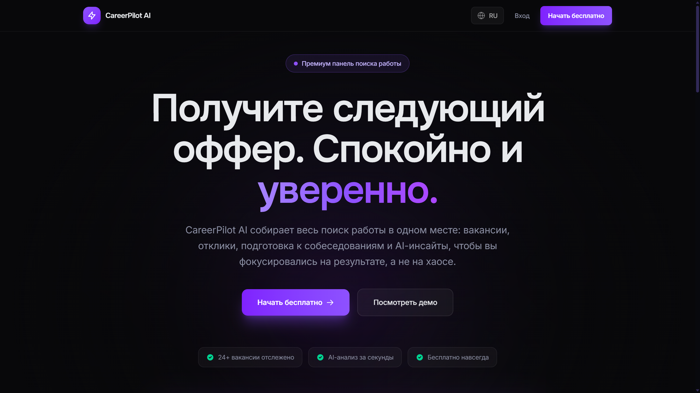

---

### Authentication

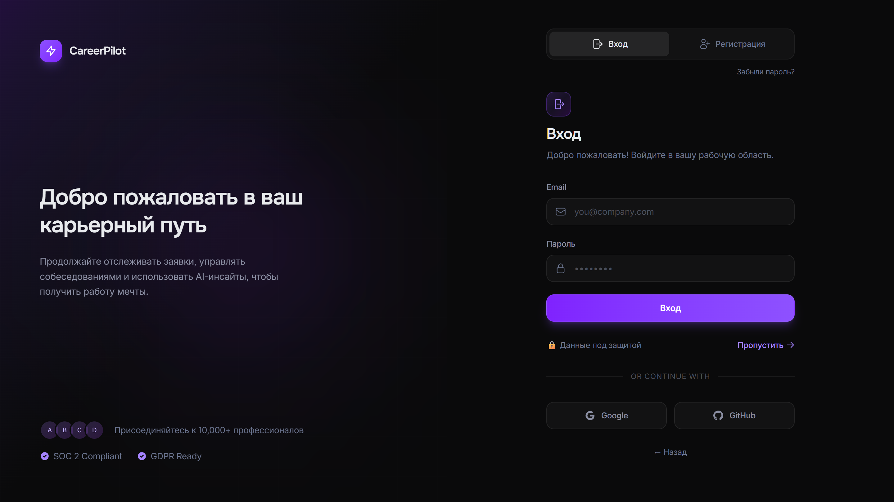

---

### Dashboard

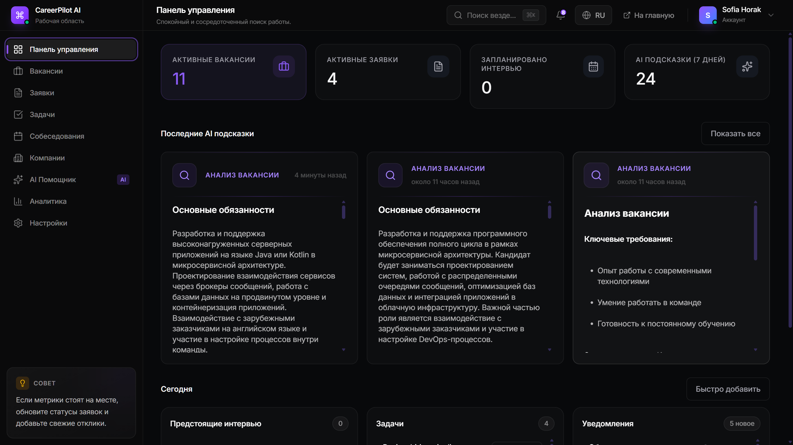

---

### Vacancies

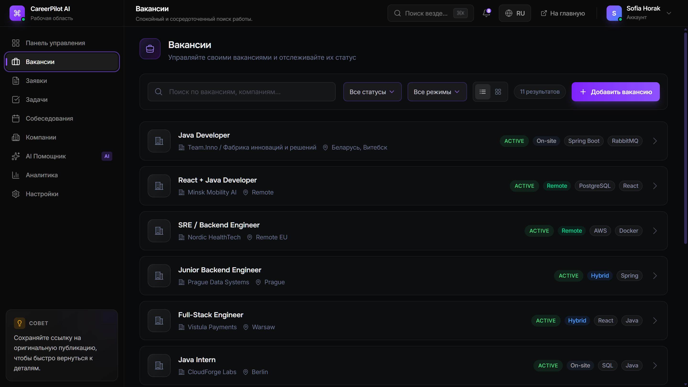

---

### Vacancy Details

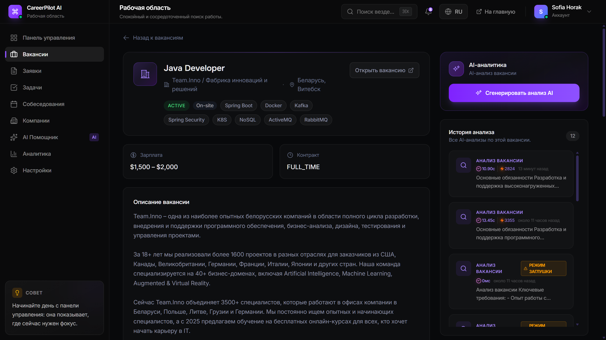

---

### Applications — Kanban Board

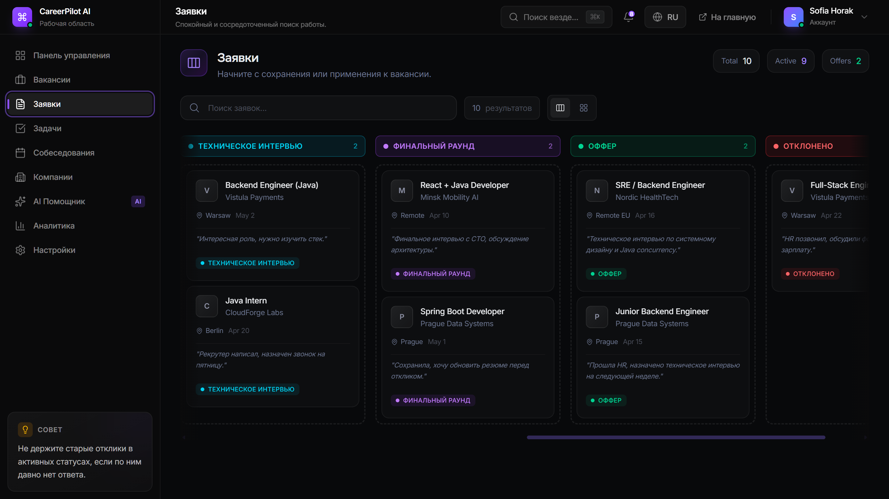

---

### Tasks

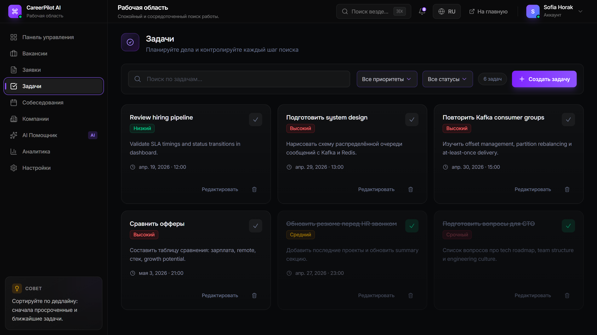

---

### Interviews

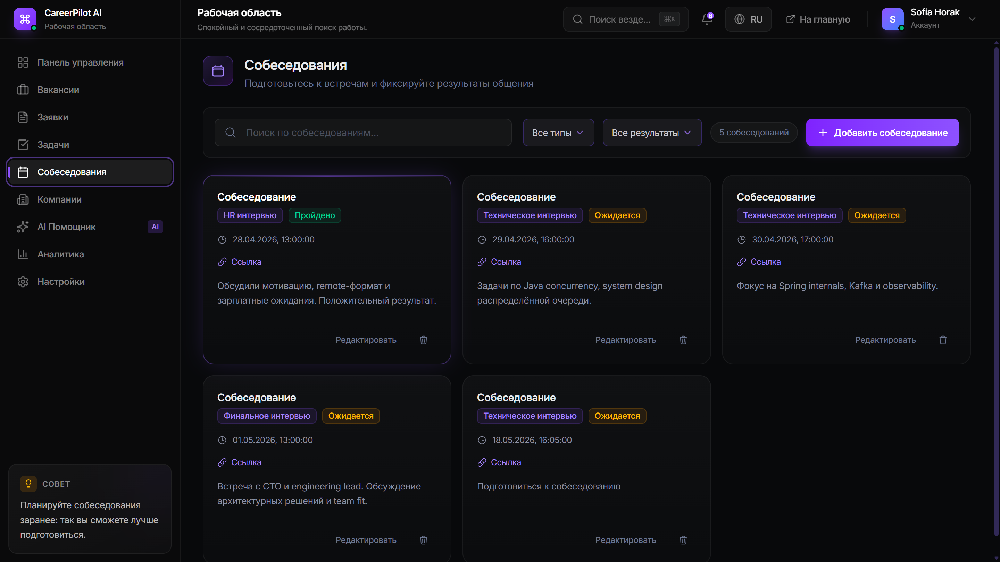

---

### Companies

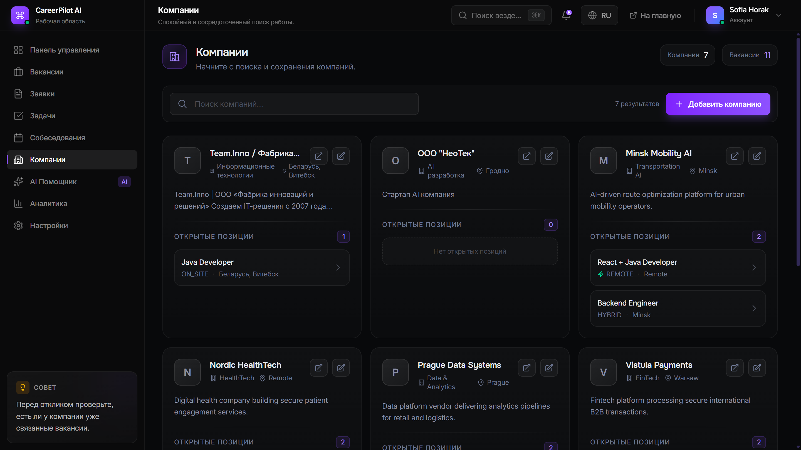

---

### AI Assistant

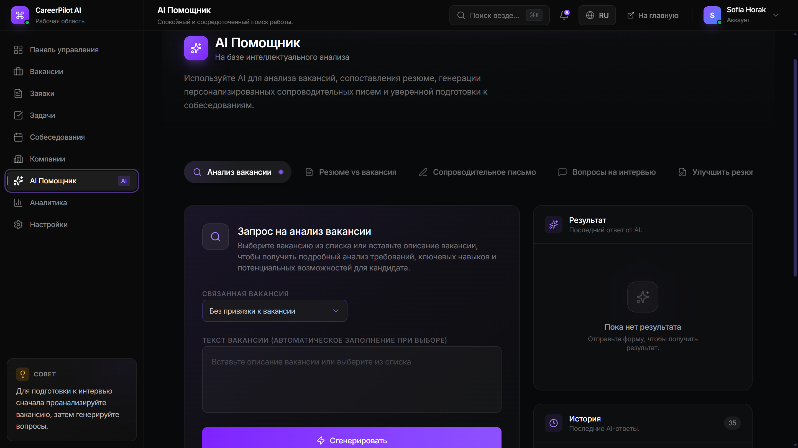

---

### Analytics

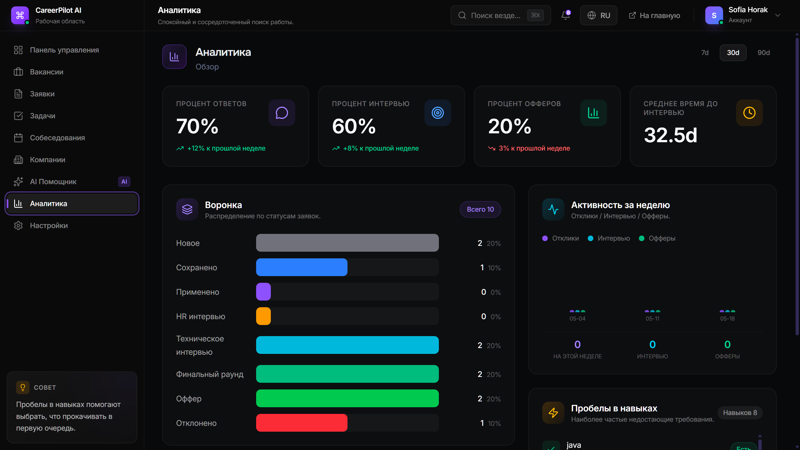

---

### Settings

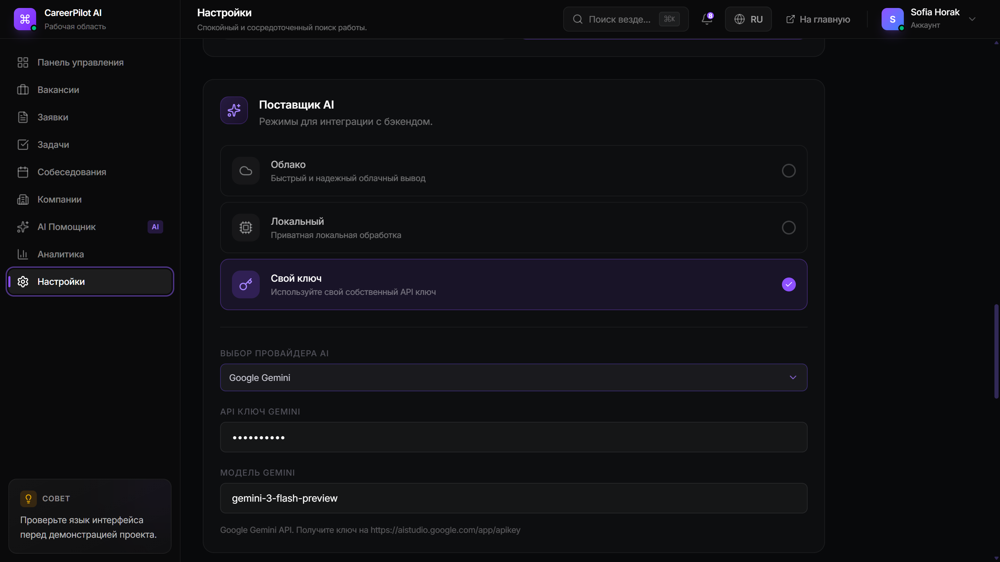

---

## 🚀 Production & Demo

### 🌐 Production (Full Features)

**[careerpilot-ai.ru](https://careerpilot-ai.ru)**

- Deployment: Google Cloud Run (frontend + backend)
- Database: Cloud SQL PostgreSQL (Google Cloud)
- CD Pipeline: GitHub Actions → Google Artifact Registry → Cloud Run
- Core integrations active: Google Calendar, Telegram Bot, OAuth2, and Cloud AI providers

### 🎭 Mock Demo (No Registration Required)

**[careerpilot-ai-sigma.vercel.app](https://careerpilot-ai-sigma.vercel.app)**

Demo account credentials:

| Field    | Value                  |
|----------|------------------------|
| Email    | `sofia.horak@demo.dev` |
| Password | `Demo123!@#`           |

> ⚠️ Mock demo runs entirely in **mock data mode** — no backend is connected.
> Data resets upon refreshing the page. For full features, visit [careerpilot-ai.ru](https://careerpilot-ai.ru).

---

## About the Project

Job searching can quickly become a messy collection of tabs, spreadsheets, notes, and reminders.
CareerPilot AI unifies this process into a clean, intuitive workflow:

- Keep track of job vacancies and companies;
- Monitor application stages using a beautiful drag-and-drop Kanban board;
- Plan tasks (Tasks) and schedule interviews (Interviews);
- Utilize AI to analyze job descriptions, compare resumes, generate tailored cover letters, and prepare interview questions;
- Search everything instantly with global hotkey-driven search (Cmd+K);
- Analyze your job search progress with visual metrics;
- Enjoy a full UI localized in both English and Russian.

---

## ✅ What's Implemented

### Backend (REST API)

| Slice         | Endpoints                                                                                                     | Status |
|---------------|---------------------------------------------------------------------------------------------------------------|--------|
| Auth          | `POST /auth/register`, `POST /auth/login`, `GET /auth/me`, `POST /auth/forgot-password`, `POST /auth/reset-password`, `POST /auth/password`, `POST /auth/refresh`, `POST /auth/logout` | ✅      |
| OAuth2        | Authentication via GitHub / Google, automatic profile mapping, support for private emails                     | ✅      |
| Vacancies     | Full CRUD, pagination, user ownership, company data loading without N+1                                       | ✅      |
| Companies     | Full CRUD, pagination, user ownership                                                                         | ✅      |
| Applications  | Board, PATCH status, full CRUD, **Status History (Timeline)**                                                 | ✅      |
| Tasks         | Full CRUD, pagination, filtering, execution status toggling, connection with Applications                     | ✅      |
| Interviews    | Full CRUD, pagination, filtering by type/result, connection with Applications                                 | ✅      |
| Resumes       | Full CRUD, transactional logic for setting default resume, URL validation                                     | ✅      |
| Search        | `GET /api/search` — aggregated full-text search across vacancies, companies, tasks, and interviews            | ✅      |
| Analytics     | `GET /analytics/summary` with application funnel, weekly activity, and top skill gaps                         | ✅      |
| AI Assistant  | analyze-vacancy, resume-match, cover-letter, interview-questions, history                                     | ✅      |
| Dashboard     | `GET /dashboard/summary` (KPIs, upcoming interviews, AI insights, task list)                                  | ✅      |
| Profile       | `GET /profiles/me`, `PUT /profiles/me` with JSONB skills field                                                | ✅      |
| Settings      | `GET/PUT /users/me`, `GET/PUT /preferences`, `DELETE /users/me` (Secure Deletion)                              | ✅      |
| Notifications | `GET /notifications` (pagination, read filter), `PATCH /{id}/read`, **Telegram Integration** (Strategy/Factory pattern) | ✅      |

### Frontend

- World-class UI redesign inspired by **Linear / Vercel / Clerk** — dark mode, glassmorphism, violet accents.
- **Kanban Board** with drag-and-drop (dnd-kit), DragOverlay-preview, optimistic updates.
- **Interactive Tasks & Interviews** — full CRUD, filtering, unified styling.
- **Calendar Export** — support for downloading `.ics` files and direct sync with **Google Calendar** via OAuth2.
- **Global Search (Cmd+K / Ctrl+K)** — hotkey modal with debounced search and quick entity navigation.
- **AI Assistant** — 5 tools with dynamic forms, auto-filled resume/vacancy selectors, advanced validation, and search history.
- **Analytics** — KPI cards, conversion funnel, activity chart based on calendar weeks, and skill gaps.
- **Dashboard** — fully integrated with backend via React Query, skeleton loading, quick-toggle tasks.
- **Settings** — profile editor (skills input), resume management (Zod validation), password manager (including password generation for OAuth2 accounts).
- React Query (TanStack Query) for robust caching and invalidation.
- Error boundaries + unified Toast notification system with automatic HTTP error interceptors.
- i18n: `ru` + `en` with a language switcher and localized date rendering (`date-fns`).

### Security & Infrastructure

- **Refresh Tokens:** Automatic session extension via HttpOnly Cookies, secure logout with session invalidation in the database.
- **Rate Limiting:** Request rate limiting for AI endpoints using the Token Bucket algorithm (Bucket4j, HTTP 429).
- **Audit Trail:** Secure journaling of critical user activities (login, entity mutations, AI queries) in PostgreSQL.
- **Secure Key Storage:** Transparent encryption (AES-256) of user-provided OpenAI API keys stored in the database.
- **Full-Stack Docker Compose:** Launch the entire stack (backend + frontend + PostgreSQL + Redis + optional MinIO/Ollama) with a single command: `docker compose up -d --build`. Nginx handles API proxying and OAuth2 callbacks.
- **AI Integration:** Ollama as local provider with automatic fallback to mock responses.
- **Redis Cache:** AI response caching (TTL 24h, with automatic fallback if Redis is down).
- **CI Pipeline:** GitHub Actions for frontend lint/build + backend unit testing on every push and PR to main.
- **CD Pipeline:** GitHub Actions → Docker → Google Artifact Registry → Cloud Run (auto-deploy on push to main).
- **Production Hosting:** Google Cloud Run (`europe-west1`) running nginx-frontend container and Spring Boot backend. Google Cloud SQL PostgreSQL (`europe-west3`) database. Domain: [careerpilot-ai.ru](https://careerpilot-ai.ru).

---

## 🔧 Tech Stack

### Backend

`Java 21` · `Spring Boot 3` · `Spring Security` · `OAuth 2.0` · `JWT` · `Spring Data JPA` · `PostgreSQL` · `Flyway` · `MapStruct` ·
`Bean Validation` · `OpenAPI / Swagger` · `JUnit 5` · `Mockito` · `Testcontainers` · `Redis` · `Bucket4j`

### Frontend

`React` · `TypeScript` · `Vite` · `Tailwind CSS` · `React Router` · `TanStack Query` · `React Hook Form` · `Zod` ·
`dnd-kit` · `i18next` · `lucide-react` · `date-fns`

### Infrastructure

`Docker` · `Docker Compose` · `PostgreSQL` · `Redis` · `GitHub Actions CI/CD` · `Google Cloud Run` · `Google Artifact Registry` · `Cloud SQL`

---

## ⚠️ Known Limitations

Current status for `v1.0.0-beta`:

- **Backend:** Integration tests using Testcontainers require a running local Docker environment.
- **Redis:** Redis is disabled in production Cloud Run (`SPRING_CACHE_TYPE=none`) — requires a VPC Connector to hook up Google Memorystore.

See the full roadmap and task status at [ROADMAP.en.md](./ROADMAP.en.md).

---

## 🗂️ Directory Structure

```text
careerpilot-ai/
├── backend/          Spring Boot backend
├── frontend/         React + TypeScript frontend
├── docs/             Documentation and API contract
│   ├── assets/       Screenshots for README
│   └── en/           English documentation
├── .github/
│   └── workflows/
│       ├── ci.yml    CI — lint, build, unit tests
│       └── cd.yml    CD — Docker build + Cloud Run deploy
├── README.md         English documentation (default)
├── README.ru.md      Russian documentation
├── ROADMAP.md        Roadmap (Russian)
├── ROADMAP.en.md     Roadmap (English)
├── docker-compose.yml
└── LICENSE
```

---

## 🖥️ Local Setup

### 0. Full-stack Docker (Recommended)

```bash
cp .env.docker.example .env   # fill in the secrets
docker compose up -d --build
```

Frontend: `http://localhost` · Backend Swagger: `http://localhost:8080/swagger-ui.html`

Read more in [docs/en/DEPLOYMENT.md](./docs/en/DEPLOYMENT.md)

---

### 1. Infrastructure (Local Dev)

```bash
docker compose up -d postgres redis
```

Optional profiles:

```bash
docker compose --profile ai up -d ollama      # local LLM
docker compose --profile storage up -d minio  # file storage
```

### 2. Backend

**Windows:**

```powershell
cd backend
.\mvnw.cmd spring-boot:run
```

**Unix-like:**

```bash
cd backend
./mvnw spring-boot:run
```

The backend will start at `http://localhost:8080`. Swagger UI is available at `http://localhost:8080/swagger-ui.html`.

Environment variables list can be found in `backend/.env.example`. Real `.env` is git-ignored.

### 3. Frontend

```bash
cd frontend
pnpm install
pnpm run dev
```

The frontend will start at `http://localhost:5173`.

Core environment variables:

| Variable            | Description             | Default                     |
|---------------------|-------------------------|-----------------------------|
| `VITE_API_BASE_URL` | Base URL for REST API   | `http://localhost:8080/api` |
| `VITE_USE_MOCKS`    | Mock mode (no backend)  | `false`                     |

### 4. Tests & Quality Checks

```bash
# Frontend
cd frontend && pnpm run lint && pnpm run build

# Backend
cd backend && ./mvnw test
```

---

## 📚 Documentation

| Document                                                                       | Contents                       |
|--------------------------------------------------------------------------------|--------------------------------|
| [ROADMAP.en.md](./ROADMAP.en.md)                                               | Development phases & status    |
| [docs/en/README.DEV.md](./docs/en/README.DEV.md)                               | Developer's guidelines         |
| [docs/en/DEPLOYMENT.md](./docs/en/DEPLOYMENT.md)                               | Docker Compose & Cloud Run Deployment |
| [docs/en/FRONTEND_BACKEND_CONTRACT.md](./docs/en/FRONTEND_BACKEND_CONTRACT.md) | API Contract (source of truth) |
| [docs/en/I18N_IMPLEMENTATION.md](./docs/en/I18N_IMPLEMENTATION.md)             | i18n Implementation Details    |

---

## 📝 Note

Secrets, `.env` files, build artifacts, IDE configs, and dependency folders are excluded via `.gitignore`.
Only `.env.example` and `.env.docker.example` are committed for the public repository.