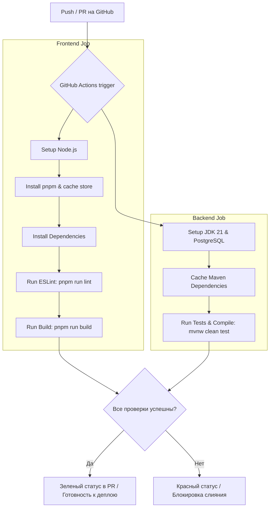

# Собеседовdание на Full-Stack / Junior-to-Mid Backend (Spring + React): Тема CI/CD (Continuous Integration & Continuous Delivery)

Этот гайд подготовлен для того, чтобы помочь тебе пройти техническое собеседование с Тимлидом или DevOps-инженером. Весь материал подан через призму реального опыта в твоем проекте **CareerPilot AI**, с разбором конфигурации GitHub Actions, решения проблем с кэшированием pnpm и линтингом фронтенда.

---

## 1. Базовая теория: Как рассказать про CI/CD "на пальцах"

### 🎙️ Вопрос Тимлида: *"Что такое CI/CD, зачем это нужно и какие проблемы эти процессы решают?"*

**💡 Твой ответ (как сказать правильно):**
> «**CI/CD** — это культура и набор практик автоматизации сборки, тестирования и доставки кода.
> * **CI (Continuous Integration / Непрерывная интеграция)** отвечает за то, чтобы каждый коммит разработчика автоматически собирался, проверялся линтером и прогонялся через юнит- и интеграционные тесты. Цель — обнаружить конфликты слияния (merge conflicts), синтаксические ошибки, баги сборки и упавшие тесты как можно раньше (до того, как код попадет в основную ветку `main`).
> * **CD (Continuous Delivery или Deployment / Непрерывная доставка/развертывание)** отвечает за автоматический деплой успешно собранного и протестированного приложения на тестовый (Staging) или продакшн (Production) сервер.
>
> Без CI/CD мы тратим кучу времени на ручную сборку, забываем запустить тесты перед деплоем, а фраза *"у меня на локальной машине все работает"* становится причиной падения продакшна».

### 📋 Разница между Continuous Delivery и Continuous Deployment:
Если тимлид попросит уточнить тонкости терминологии CD:
1. **Continuous Delivery (Непрерывная доставка)** — после успешных тестов сборка автоматически готова к деплою (создается Docker-образ или артефакт), но сам выпуск на продакшн происходит **вручную по нажатию кнопки** (после аппрува лида).
2. **Continuous Deployment (Непрерывное развертывание)** — полностью автоматический процесс. Каждый коммит, успешно прошедший пайплайн CI, **сразу же попадает на "живой" сервер** без какого-либо участия человека.

---

## 2. Анатомия пайплайна в CareerPilot AI

### 🎙️ Вопрос Тимлида: *"Как у вас настроен CI/CD процесс в проекте? Какие инструменты вы использовали?"*

**💡 Твой ответ:**
> «В **CareerPilot AI** мы используем **GitHub Actions** в качестве платформы автоматизации, так как наш код хранится на GitHub, и это позволяет настраивать пайплайны декларативно прямо в репозитории через YAML-файлы.
> 
> Наш монорепозиторий состоит из бэкенда на Spring Boot и фронтенда на React. Пайплайн настроен так, чтобы запускаться при каждом Pull Request или Push в ветку `main`».



---

## 3. Детальный разбор конфигурации `.github/workflows/ci.yml`

Тимлид может попросить тебя показать или объяснить структуру твоего YAML-файла пайплайна. Ты должен четко ориентироваться в ключевых блоках.

### А. Триггеры пайплайна (Triggers)
```yaml
name: CI Pipeline

on:
  push:
    branches: [ main ]
  pull_request:
    branches: [ main ]
```
> **Что сказать:** «Мы запускаем сборку при пуше или создании пулл-реквеста в ветку `main` (основная продакшн-ветка). Это гарантирует, что сломанный код физически не сможет слиться без исправления».

---

### Б. Шаги фронтенд-сборки (Frontend Job)
```yaml
jobs:
  frontend:
    name: Frontend CI
    runs-on: ubuntu-latest
    steps:
      - uses: actions/checkout@v4

      - name: Install pnpm
        uses: pnpm/action-setup@v4
        with:
          version: 9

      - name: Setup Node.js
        uses: actions/setup-node@v4
        with:
          node-version: 20
          cache: "pnpm"
          cache-dependency-path: frontend/pnpm-lock.yaml

      - name: Install dependencies
        run: pnpm install --frozen-lockfile
        working-directory: frontend

      - name: Run lint
        run: pnpm run lint
        working-directory: frontend

      - name: Run tests
        run: pnpm run test
        working-directory: frontend

      - name: Run build
        run: pnpm run build
        working-directory: frontend
```
> **Что сказать про фронтенд-шаги:**
> 1. Мы используем **pnpm** вместо npm/yarn, так как он работает намного быстрее за счет жестких ссылок и общего хранилища пакетов.
> 2. Мы настроили **кэширование pnpm-зависимостей** (`cache: 'pnpm'`), указывая точный путь к `pnpm-lock.yaml`. Это ускоряет сборку в CI в 2-3 раза (с минут до нескольких секунд).
> 3. Мы используем флаг `--frozen-lockfile` при установке зависимостей. Это гарантирует, что CI установит абсолютно те же версии пакетов, которые зафиксированы разработчиком, и не будет пытаться обновить их "на лету", что могло бы сломать сборку.
> 4. Запускаем **линтинг → юнит-тесты → билд** в строгом порядке. Это позволяет получить быстрый сигнал об ошибке: если упал lint, тесты и билд даже не начнутся.

---

### В. Шаги бэкенд-сборки (Backend Job)
```yaml
  backend:
    name: Backend CI
    runs-on: ubuntu-latest
    steps:
      - uses: actions/checkout@v4

      - name: Set up JDK 21
        uses: actions/setup-java@v4
        with:
          java-version: "21"
          distribution: "temurin"
          cache: maven

      - name: Run unit tests
        run: ./mvnw test --no-transfer-progress
        working-directory: backend
```
> **Что сказать про бэкенд-шаги:**
> 1. Используем `actions/setup-java` с дистрибутивом `temurin` (рекомендованный OpenJDK стандарт) и встроенным кэшированием `maven` зависимостей (`.m2` директория).
> 2. **Важно:** В текущей конфигурации мы запускаем только **unit-тесты** (`./mvnw test`) без поднятия PostgreSQL. Флаг `--no-transfer-progress` убирает лишний вывод прогресса скачивания зависимостей, делая логи CI чище.
> 3. Мы **сознательно** не запускаем интеграционные тесты с реальной БД в CI прямо сейчас, так как это потребовало бы либо поднять PostgreSQL через `services:` в GitHub Actions, либо переключиться на **Testcontainers**. Это — следующий шаг эволюции пайплайна.
> 4. *Как это выглядит в развитой системе (для собеседования):* «В зрелом проекте я добавил бы блок `services: postgres:` с образом `postgres:16-alpine` и передавал бы `SPRING_DATASOURCE_URL` через `env:`, чтобы интеграционные тесты могли проверить репозиторный слой с реальной СУБД».

---

## 4. Продвинутые вопросы, "Ловушки" и Lessons Learned (Твой опыт!)

На собеседовании на Mid-разработчика ценятся не заученные YAML-конфиги, а реальные истории борьбы с багами CI/CD. Расскажи про реальный опыт разработки CareerPilot AI!

### 🔥 Тонкость №1: Ошибка кэширования "Some specified paths were not resolved, unable to cache dependencies"
* **Тимлид спрашивает:** *"Бывали ли у вас проблемы с кэшированием в GitHub Actions и как вы их решали?"*
* **Ты отвечаешь:**
  > «Да, в монорепозиториях это классическая проблема. Изначально мы использовали стандартный `actions/setup-node` с кэшем `npm`. Но так как во фронтенде мы перешли на `pnpm`, а структура проекта — монорепозиторий (фронтенд лежит в подпапке `./frontend`), экшен Node.js выдавал ошибку: *`Some specified paths were not resolved, unable to cache dependencies`*.
  > 
  > **Решение:** Мы явно подключили `pnpm/action-setup@v4` для инициализации pnpm до настройки Node.js, а в `setup-node` передали `cache: 'pnpm'` и явно указали путь к файлу логов зависимостей через параметр `cache-dependency-path: frontend/pnpm-lock.yaml`. Это полностью решило проблему и вернуло кэширование в строй».

---

### 🔥 Тонкость №2: Тестирование с Testcontainers в CI без Docker
* **Тимлид спрашивает:** *"Если на бэкенде интеграционные тесты используют Testcontainers (например, для поднятия Redis или БД во время тестов), как это отражается на CI в GitHub Actions?"*
* **Ты отвечаешь:**
  > «Интеграционные тесты с **Testcontainers** требуют наличия Docker-демона на хост-машине. Раннеры GitHub Actions (`ubuntu-latest`) поставляются с уже установленным и запущенным Docker из коробки, поэтому такие тесты выполняются там успешно.
  > 
  > Однако, если мы используем локальный запуск CI (например, через утилиту `act` или на приватных раннерах без Docker-in-Docker), Testcontainers упадет с ошибкой. В таких сценариях мы пишем логику фоллбека — если Docker недоступен, мы можем отключать интеграционные тесты через `@DisabledIfSystemProperty` или профили Maven (например, `-Punit-tests-only`), фокусируясь исключительно на Unit-тестах бизнес-логики, которые работают везде и запускаются моментально».

---

### 🔥 Тонкость №3: Конфликты асинхронности (@Async) в тестах Spring Boot
* **Тимлид спрашивает:** *"Иногда тесты в CI падают из-за нестабильности (flaky tests), особенно при наличии асинхронных процессов. Сталкивались с этим?"*
* **Ты отвечаешь:**
  > «Да. В нашем проекте при отправке уведомлений или фоновом аудите используется аннотация Spring `@Async`. При поднятии полноценного контекста приложения в интеграционных тестах (`@SpringBootTest`) вместе с Testcontainers асинхронные потоки могут не успеть завершиться до закрытия контекста или заблокировать базу данных, что приводило к случайным падениям сборки в CI.
  > 
  > **Решение:** Для тестового окружения мы отключаем асинхронность (делаем выполнение задач синхронным) с помощью специальных настроек профиля (например, создаем тестовый бин `Executor`, который выполняет задачи в вызывающем потоке `SyncTaskExecutor`), либо используем утилиту `Awaitility` для явного ожидания завершения асинхронных событий в тестах».

---

### 🔥 Тонкость №4: Разница между pnpm install и pnpm ci / --frozen-lockfile
* **Тимлид спрашивает:** *"Почему в CI нельзя использовать обычный `npm install` или `pnpm install` без дополнительных флагов?"*
* **Ты отвечаешь:**
  > «Если запустить обычный `pnpm install` в CI, пакетный менеджер может увидеть несоответствие версий в `package.json` и `pnpm-lock.yaml` и перезаписать лок-файл прямо во время сборки, подтянув новые минорные версии из сети. 
  > Это нарушает принцип детерминированности сборки — мы рискуем собрать в CI код с версиями библиотек, которые мы локально даже не тестировали. Флаг `--frozen-lockfile` (аналог `npm ci`) принудительно запрещает обновление лок-файла. Если версии разошлись, сборка в CI упадет с ошибкой, предупредив нас о необходимости синхронизировать лок-файл локально».

---

## 5. Как разворачивать CI/CD с нуля на новом проекте

Если тебя попросят описать дорожную карту внедрения CI/CD в новый коммерческий проект:

1. **Этап 1: Линтинг и форматирование** — Настроить ESLint/Prettier (для фронта) и Checkstyle/SpotBugs (для Java бэка). Без этого разработчики будут бесконечно спорить о форматировании на пул-реквестах.
2. **Этап 2: Сборка и Unit-тесты** — Написать минимальный CI-скрипт, который просто собирает проект (`mvn clean compile` / `npm run build`) и гоняет юнит-тесты на каждый коммит. Это отсекает 80% глупых ошибок.
3. **Этап 3: Кэширование и ускорение пайплайна** — Настроить кэширование Maven/Gradle зависимостей и `node_modules`. Пайплайн, работающий дольше 10 минут, начинает раздражать команду. Идеальное время — 3-5 минут.
4. **Этап 4: Интеграционные тесты и базы данных** — Подключить базы данных (PostgreSQL/Redis) через сервисы CI или Testcontainers для полноценных интеграционных тестов API.
5. **Этап 5: Автоматический деплой (CD)** — Настроить сборку Docker-образов, их пуш в реестр (Docker Hub, GitHub Packages) и деплой на сервер (через Ansible, ssh-deploy, или Kubernetes/Vercel/Render API).

---

## 💡 Полезные советы для успешного прохождения собеседования:
* **Подчеркивай роль качества кода**: Всегда говори, что CI/CD — это твой главный союзник. Линтер и тесты в CI защищают тебя от собственных ошибок и дают уверенность при проведении рефакторинга.
* **Показывай прагматизм**: DevOps-инструменты должны служить бизнесу. Не нужно усложнять CI/CD на старте стартапа (не нужно городить Kubernetes там, где достаточно Docker Compose или простого скрипта деплоя на VPS). Начинай с малого и усложняй по мере роста проекта.
* **Терминология**: Свободно используй термины *«раннер» (runner)*, *«шаг» (step)*, *«работа» (job)*, *«артефакт» (artifact)*, *«лок-файл» (lockfile)*, *«флэйки-тест» (flaky test)*. Это маркеры того, что ты действительно работал с этими системами.
