# Собеседование на Junior/Middle Backend (Spring + React): Тема Email-рассылки и SMTP (Local vs Production)

Этот гайд подготовлен для того, чтобы помочь тебе пройти техническое собеседование с Тимлидом или Архитектором. Весь материал подан через призму реальной реализации в твоем проекте **CareerPilot AI** (функционал сброса пароля через почту), с разбором конкретных классов, конфигураций тестирования и тонких нюансов доставки писем в продакшене.

---

## 1. Базовая теория: Как рассказать про Email-рассылку "на пальцах"

### 🎙️ Вопрос Тимлида: *"Как устроена отправка писем из Java/Spring приложения на базовом уровне?"*

**💡 Твой ответ (как сказать правильно):**
> «В мире Java стандартным API для работы с почтой является **Jakarta Mail** (ранее JavaMail). В Spring Boot мы используем стартер `spring-boot-starter-mail`, который оборачивает Jakarta Mail и предоставляет удобный бин **`JavaMailSender`**.
>
> Процесс устроен следующим образом: наше приложение подключается по протоколу **SMTP (Simple Mail Transfer Protocol)** к почтовому серверу (релею). Мы передаем серверу тело письма, адрес получателя и авторизационные данные. Далее этот почтовый сервер берет на себя задачу по доставке письма на сервер получателя (например, на сервера Google/Yandex)».

### 📋 Ключевые термины, которые нужно знать:
1. **SMTP (Simple Mail Transfer Protocol)** — протокол, по которому мы *отправляем* почту (обычно порты `25`, `465` (SSL/TLS) или `587` (STARTTLS)).
2. **IMAP / POP3** — протоколы, по которым почтовые клиенты (например, Outlook или Gmail на телефоне) *получают и читают* почту. Бэкенду для рассылки уведомлений они обычно не нужны.
3. **MimeMessage** — объект Jakarta Mail, представляющий сложное письмо с поддержкой HTML-разметки, альтернативного текста, вложений (attachments) и встроенных изображений.
4. **SimpleMailMessage** — более простой класс Spring, подходящий только для плоского текста (без HTML и вложений).

---

## 2. Пошаговый флоу сброса пароля (Password Reset Flow) в CareerPilot AI

Когда пользователь нажимает «Забыл пароль» на фронтенде, запускается асинхронный процесс генерации токена и отправки письма.

```mermaid
sequenceDiagram
    actor User as Пользователь
    participant FE as React Frontend
    participant BE as Spring Boot Backend
    participant DB as PostgreSQL
    participant SMTP as SMTP Server (Mailtrap/Prod)
    
    User->>FE: Ввод email + клик "Сбросить пароль"
    FE->>BE: POST /api/v1/auth/forgot-password (email)
    Note over BE: Проверка email, генерация токена<br/>Сохранение токена в БД с TTL (например, 15 мин)
    BE->>DB: INSERT INTO password_reset_tokens
    
    Note over BE: Асинхронный запуск в фоне (@Async)
    BE-->>FE: HTTP 200 OK ("Инструкция отправлена")
    
    rect rgb(30, 20, 40)
        Note over BE, SMTP: Выполнение в фоновом потоке
        BE->>BE: Рендеринг HTML-шаблона с ссылкой
        BE->>SMTP: SMTP Handshake & Передача письма (send)
        SMTP-->>User: Доставка письма во входящие
    end
    
    User->>FE: Клик по ссылке из письма (?token=...)
    FE->>FE: Отображение формы "Новый пароль"
    User->>FE: Ввод нового пароля
    FE->>BE: POST /api/v1/auth/reset-password (token, newPassword)
    BE->>DB: SELECT * FROM password_reset_tokens WHERE token = ...
    Note over BE: Проверка TTL токена,<br/>Хэширование пароля (BCrypt)
    BE->>DB: UPDATE users SET password_hash = ...<br/>DELETE FROM password_reset_tokens
    BE-->>FE: HTTP 200 OK ("Пароль успешно изменен")
    FE->>User: Редирект на логин
```



---

## 3. Настройка тестового окружения (Local Sandbox)

На этапе разработки отправлять письма на реальные адреса опасно (можно случайно заспамить клиентов тестовыми данными) и неудобно (нужно постоянно проверять личный ящик).

### 🎙️ Вопрос Тимлида: *"Как вы тестировали отправку писем локально в процессе разработки?"*

**💡 Твой ответ:**
> «Для тестирования локально мы используем "песочницы" (SMTP Sandboxes). Самый популярный SaaS-вариант — **Mailtrap.io**, а для полностью автономной локальной работы — Docker-контейнер с **Mailpit** или **Mailhog**.
>
> Эти инструменты поднимают локальный SMTP-сервер, который перехватывает все исходящие письма нашего приложения. Они не отправляют их реальным адресатам, а складывают в красивый веб-интерфейс, где разработчик может посмотреть верстку письма, проверить заголовки и проанализировать спам-рейтинг».

### А. Настройка в `application.yaml` через переменные окружения `.env`
Локальные настройки в проекте берутся из переменных окружения:
```yaml
spring:
  mail:
    host: ${MAIL_HOST:localhost}
    port: ${MAIL_PORT:1025} # Для Mailpit по умолчанию 1025, для Mailtrap — 2525
    username: ${MAIL_USERNAME:}
    password: ${MAIL_PASSWORD:}
    properties:
      mail:
        smtp:
          auth: ${MAIL_SMTP_AUTH:false}
          starttls:
            enable: ${MAIL_SMTP_STARTTLS_ENABLE:false}
```

### Б. Детальный разбор бэкенд-кода в CareerPilot AI
Мы используем `JavaMailSender` для отправки HTML-писем и аннотацию `@Async` для фонового выполнения, чтобы не блокировать UI-поток пользователя.

#### Интерфейс сервиса `EmailService.java`:
```java
package com.alexanderpolozhnov.careerpilot.notification.service;

public interface EmailService {
    void sendPasswordResetEmail(String to, String token);

    void sendReminderEmail(String to, String title, String message);
}
```
> Интерфейс содержит **два метода**: первый — для флоу сброса пароля, второй — для **напоминаний (Reminders)**. Напоминания автоматически отправляются через `ReminderScheduler` по `@Scheduled`-таймеру пользователям, у которых включены email-уведомления в настройках.

#### Реализация `EmailServiceImpl.java`:
```java
@Slf4j
@Service
@RequiredArgsConstructor
public class EmailServiceImpl implements EmailService {
    private final JavaMailSender mailSender;
    
    @Value("${app.frontend-url}")
    private String frontendUrl;

    @Async
    @Override
    public void sendPasswordResetEmail(String to, String token) {
        String resetLink = frontendUrl + "/auth/reset-password?token=" + token;
        log.info("PASSWORD RESET REQUEST for: {}", to);
        log.info("RESET LINK: {}", resetLink);

        try {
            MimeMessage message = mailSender.createMimeMessage();
            MimeMessageHelper helper = new MimeMessageHelper(
                message,
                MimeMessageHelper.MULTIPART_MODE_MIXED_RELATED,
                StandardCharsets.UTF_8.name()
            );

            helper.setFrom("no-reply@careerpilot.ai", "CareerPilot AI");
            helper.setTo(to);
            helper.setSubject("Сброс пароля — CareerPilot AI");
            helper.setText(buildResetPasswordHtml(resetLink), true); // true = HTML

            mailSender.send(message);
            log.info("SUCCESS: HTML Password reset email sent to: {}", to);
        } catch (Exception e) {
            log.error("CRITICAL ERROR: Failed to SEND HTML email to {}.", to);
            log.error("SMTP Error Message: {}", e.getMessage());
        }
    }

    @Async
    @Override
    public void sendReminderEmail(String to, String title, String message) {
        log.info("REMINDER EMAIL for: {}, TITLE: {}", to, title);

        try {
            MimeMessage mimeMessage = mailSender.createMimeMessage();
            MimeMessageHelper helper = new MimeMessageHelper(
                mimeMessage,
                MimeMessageHelper.MULTIPART_MODE_MIXED_RELATED,
                StandardCharsets.UTF_8.name()
            );

            helper.setFrom("no-reply@careerpilot.ai", "CareerPilot AI");
            helper.setTo(to);
            helper.setSubject(title + " — CareerPilot AI");
            helper.setText(buildReminderHtml(title, message), true);

            mailSender.send(mimeMessage);
            log.info("SUCCESS: HTML Reminder email sent to: {}", to);
        } catch (Exception e) {
            log.error("CRITICAL ERROR: Failed to SEND reminder email to {}.", to);
            log.error("SMTP Error Message: {}", e.getMessage());
        }
    }
    
    // HTML-верстка с Dark Mode, Onest Font, градиентами
    private String buildResetPasswordHtml(String resetLink) { /* ... */ }
    private String buildReminderHtml(String title, String message) { /* ... */ }
}
```

---

## 4. Переход на реальный продакшн (Production Mailer)

Когда приложение готово к выходу "в свет", мы должны переключиться на реальный почтовый сервис.

### 🎙️ Вопрос Тимлида: *"Как перевести отправку писем на продакшн? Какие шаги нужно предпринять на уровне инфраструктуры?"*

**💡 Твой ответ:**
> «Переход на продакшн состоит из двух частей: выбор **провайдера рассылок** и **настройка DNS-записей домена** для защиты от попадания в спам.
>
> 1. **Выбор провайдера**: Использовать обычный личный Gmail/Yandex ящик в продакшене нельзя из-за жестких лимитов (обычно не более 100-500 писем в день) и риска блокировки аккаунта. Нужно использовать специализированные облачные SMTP-транспорты: **AWS SES (Simple Email Service)**, **Mailgun**, **SendGrid**, **Yandex 360 для бизнеса** или SMTP от хостинга (например, Beget, Webhost).
> 2. **Настройка приложения**: Мы просто меняем переменные окружения (`MAIL_HOST`, `MAIL_PORT`, `MAIL_USERNAME`, `MAIL_PASSWORD`) в Docker Compose продакшена на креды, выданные провайдером. Также включаем TLS/SSL:
>    - `MAIL_SMTP_AUTH=true`
>    - `MAIL_SMTP_STARTTLS_ENABLE=true`
> 3. **Настройка DNS на стороне домена**: Это самый важный шаг. Без него наши письма будут 100% улетать в папку "Спам" на почтах пользователей (особенно на Gmail, Mail.ru)».

---

### 🛡️ Сверх-важная тема: Настройка DNS-безопасности (SPF, DKIM, DMARC)

Тимлиды обожают гонять кандидатов по теме "Почему письма уходят в спам и как это лечить". Выучи эти три аббревиатуры наизусть!

```
                    DNS-ЗАПИСИ НА ТВОЕМ ДОМЕНЕ (careerpilot.ai)
┌─────────────────────────────────────────────────────────────────────────────┐
│ 1. SPF: TXT "v=spf1 include:mailgun.org ~all" (Только эти IP шлют почту)    │
│ 2. DKIM: TXT mailgun._domainkey "v=DKIM1; k=rsa; p=MIIBIjANBgkq..." (Ключ)  │
│ 3. DMARC: TXT _dmarс "v=DMARC1; p=quarantine; rua=mailto:reports@..."       │
└─────────────────────────────────────────────────────────────────────────────┘
                                  │
                                  ▼
      Бэкенд слал письмо  ──────► Почтовый сервер получателя (Gmail)
                                  │
                                  ▼
                        Проверка SPF и DKIM signatures
                                  │
                    ┌─────────────┴─────────────┐
                Успешно                      Ошибка
                    │                           │
                    ▼                           ▼
            Во Входящие!                 В Спам / Отклонить
                                       (согласно DMARC политике)
```

#### 1. SPF (Sender Policy Framework)
* **Что это:** Специальная `TXT`-запись в DNS твоего домена.
* **Зачем нужно:** Она содержит список IP-адресов и серверов, которым **официально разрешено** отправлять почту от имени твоего домена (например, `careerpilot.ai`).
* **Как выглядит:**
  `v=spf1 include:mailgun.org ~all`
  *(Перевод: «От имени этого домена слать почту разрешено только серверам Mailgun. Все остальные — подозрительные (~all)»)*.

#### 2. DKIM (DomainKeys Identified Mail)
* **Что это:** Электронная цифровая подпись, которая добавляется в скрытые заголовки каждого исходящего письма.
* **Зачем нужно:** Подтверждает, что письмо действительно отправлено владельцем домена и его содержимое не было изменено в процессе передачи.
* **Как работает:** Провайдер выдает нам публичный ключ. Мы прописываем его в DNS как `TXT`-запись. Почтовый сервер получателя (например, Gmail) берет публичный ключ из нашего DNS и проверяет им цифровую подпись в заголовках пришедшего письма.

#### 3. DMARC (Domain-based Message Authentication, Reporting, and Conformance)
* **Что это:** Свод правил (политика), которая говорит почтовым серверам получателей, **что делать с письмами**, которые не прошли проверку SPF или DKIM.
* **Зачем нужно:** Защищает от фишинга и подделки писем от твоего имени.
* **Как выглядит:**
  `v=DMARC1; p=quarantine; pct=100; rua=mailto:dmarc-reports@careerpilot.ai`
  *(Перевод политики `p=quarantine`: «Если письмо не прошло проверку SPF/DKIM, отправь его в Спам (карантин). Сделай это для 100% писем. Отчеты присылай на наш ящик»)*.
  *Существуют 3 политики:*
  - `none` (просто наблюдать и слать отчеты).
  - `quarantine` (складывать в спам).
  - `reject` (сразу удалять / не принимать письмо вовсе).

#### 4. MX Record (Mail Exchanger)
Должен быть настроен на почтовый сервер, который отвечает за *прием* входящей почты для твоего домена. Многие почтовые провайдеры (например, Mail.ru) не принимают письма с доменов, у которых нет валидной MX-записи.

---

## 5. Продвинутые вопросы и "Ловушки" (Как удивить Тимлида своими знаниями)

### 🔥 Тонкость №1: Проблема транзакционных границ (Transaction Boundary Issue)
* **Тимлид спрашивает:** *"Представь: в методе сброса пароля мы генерируем токен, сохраняем его в БД (`tokenRepository.save(token)`) и следом вызываем `emailService.sendPasswordResetEmail(email, token)`. Весь метод обернут в `@Transactional`. Какие здесь таятся риски?"*
* **Ты отвечаешь:**
  > «Это классическая и очень опасная архитектурная ловушка! 
  > 
  > **Проблема:** Метод `save` сохраняет сущность в кэш Hibernate, но реальный `COMMIT` транзакции в базу данных происходит **в самом конце** работы метода. А отправка письма через `EmailService` происходит **до** коммита. Если отправка письма пройдет успешно, но при фиксации транзакции в БД произойдет сбой (например, упадет база или нарушится констреинт), транзакция откатится (`ROLLBACK`). 
  > В итоге: пользователь получит на почту красивое письмо со ссылкой на сброс, кликнет по ней, перейдет на фронт, фронт сделает запрос на бэк с этим токеном, а бэк ответит: *"Токен не найден"* (ведь транзакция в БД откатилась и токена там физически нет).
  >
  > **Как это исправить:**
  > 1. **Плохой путь:** Убрать `@Transactional` с бизнес-метода (может нарушиться консистентность данных).
  > 2. **Правильный путь (Spring Event Listener):** Вместо прямого вызова почтового сервиса внутри транзакции, мы публикуем событие через `ApplicationEventPublisher`. А слушатель этого события (`EventListener`) настраиваем с помощью аннотации **`@TransactionalEventListener(phase = TransactionPhase.AFTER_COMMIT)`**. 
  > В таком случае Spring гарантирует, что асинхронная отправка письма начнется **только после того**, как транзакция успешно запишется и закоммитится в базу данных».

---

### 🔥 Тонкость №2: Обработка ошибок в асинхронных методах (`@Async`)
* **Тимлид спрашивает:** *"Поскольку отправка почты помечена `@Async`, она выполняется в другом потоке. Метод контроллера уже вернул клиенту `200 OK`. Если на этапе SMTP-соединения произойдет ошибка (таймаут, неверный пароль к SMTP), как мы об этом узнаем и как это залогировать?"*
* **Ты отвечаешь:**
  > «Асинхронные методы с возвращаемым типом `void` не могут выбросить исключение обратно в вызывающий поток.
  >
  > Чтобы отлавливать такие ошибки в Spring, есть два подхода:
  > 1. **Локальный (try-catch внутри метода):** Самый простой способ, который мы применили в CareerPilot. Мы обернули весь блок отправки в `try-catch (Exception e)` и логируем ошибку через `@Slf4j` с уровнем `ERROR`, указывая адрес получателя. Это позволяет выявить проблемы через агрегаторы логов (например, ELK / Graylog / Grafana Loki).
  > 2. **Глобальный (`AsyncUncaughtExceptionHandler`):** Мы можем реализовать интерфейс `AsyncConfigurer` и переопределить метод `getAsyncUncaughtExceptionHandler()`. Он перехватывает все необработанные исключения из фоновых потоков и централизованно отправляет их, например, в **Sentry** или телеграм-чат дежурным разработчикам».

---

### 🔥 Тонкость №3: Вёрстка писем и блокировка SVG-иконок
* **Тимлид спрашивает:** *"Мы сделали премиальный дизайн HTML-письма с SVG иконками. Будет ли это работать во всех почтовых клиентах?"*
* **Ты отвечаешь:**
  > «Вёрстка писем застряла в начале 2000-х годов. Почтовые клиенты (особенно Outlook и мобильные приложения Gmail) имеют очень урезанные движки рендеринга HTML/CSS.
  > 
  > **Ограничения верстки писем:**
  > - **SVG-файлы запрещены**: Большинство почтовых клиентов вырежут теги `<svg>` или внешние ссылки на `.svg` файлы из соображений безопасности (скриптовые атаки внутри векторной графики). Иконки отображаться не будут.
  > - **Что делать:** Использовать классические растровые изображения (PNG/JPEG), загруженные на надежный CDN (с абсолютными `https` ссылками), либо встраивать картинки прямо в тело письма через Base64 / CID (Content-ID) вложения.
  > - **CSS-стили:** Никакого внешнего CSS-кода (`<link>`) или глобальных блоков `<style>` (многие клиенты их просто удаляют). Стили нужно писать инлайново (`style="..."`) прямо у каждого тега. Позиционирование должно быть на старых добрых HTML-таблицах (`<table>`), так как Flexbox и Grid поддерживаются некорректно».

---

### 🔥 Тонкость №4: Защита от спама и DDoS на SMTP (Rate Limiting)
* **Тимлид спрашивает:** *"Что мешает злоумышленнику написать скрипт и миллион раз вызвать наш эндпоинт `/api/v1/auth/forgot-password`, заставив наш SMTP-сервер слать миллион писем?"*
* **Ты отвечаешь:**
  > «Это приведет к двум проблемам: огромному счету от провайдера рассылок (ведь там оплата за объем) и полной блокировке нашего домена за спам.
  >
  > **Как защититься:**
  > 1. **Ограничение частоты запросов (Rate Limiting / Bucket4j):** Настроить фильтр на бэкенде, который разрешает вызывать эндпоинт забытого пароля не чаще, например, 3 раз в час с одного IP-адреса.
  > 2. **Интервал отправки для конкретного пользователя:** При отправке запроса мы проверяем в базе данных поле `last_requested_at` для этого email. Если с момента предыдущего запроса прошло меньше 1-2 минут, мы не генерируем новый токен и не шлем почту, а возвращаем ошибку *"Пожалуйста, подождите перед повторным запросом"*.
  > 3. **Внедрение Капчи:** На фронтенд-форму восстановления доступа добавить проверку Google reCAPTCHA или Cloudflare Turnstile, чтобы исключить автоматизированные запросы от ботов».

---

## 💡 Полезные советы для успешного прохождения собеседования:

1. **Показывай знание "жизненного цикла" писем**: Упомяни, что мало просто отправить письмо из кода. Важно следить за **репутацией IP-адреса** отправителя, процентом отказов (Bounce Rate) и жалобами на спам (Complaint Rate).
2. **Упомяни прогрев домена (Domain Warmup)**: Если мы купили новый домен `careerpilot.ai` и сразу отправим с него 50 000 писем, мы гарантированно попадем в спам-лист. Расскажи про постепенное наращивание объемов отправки (прогрев), чтобы алгоритмы Gmail привыкли к нашему домену.
3. **Будь скромен, но конкретен**: Не говори: *"Я настроил идеальную рассылку"*. Скажи: *«В рамках CareerPilot AI мы настроили локальный SMTP-перехватчик Mailtrap для удобного тестирования HTML-шаблонов. Для продакшена мы спроектировали схему с обязательной пропиской SPF, DKIM и DMARC записей в DNS домена, а также обсудили обработку ошибок рассылки в фоновом потоке»*.
