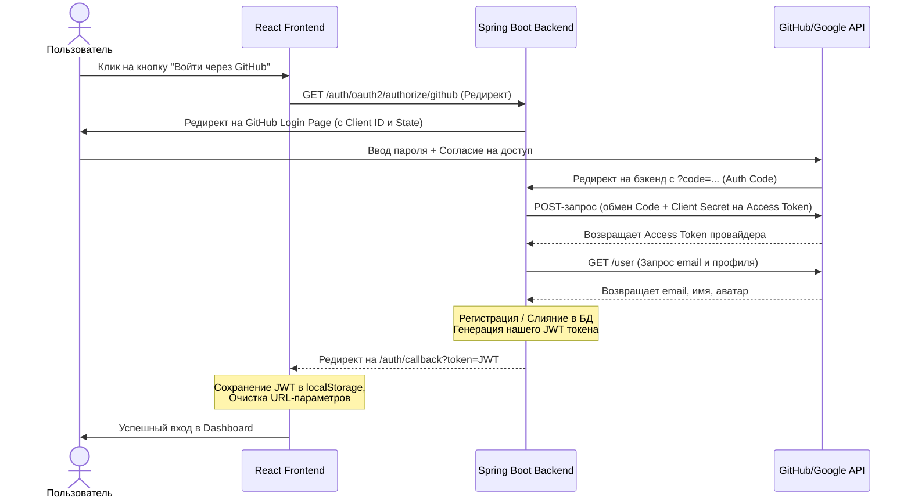

# Собеседование на Junior Backend (Spring + React): Тема OAuth2

Этот гайд подготовлен для того, чтобы помочь тебе пройти техническое собеседование с Тимлидом или Архитектором. Весь материал подан через призму реальной реализации в твоем проекте **CareerPilot AI**, с разбором конкретных классов и тонких нюансов.

---

## 1. Базовая теория: Как рассказать про OAuth2 "на пальцах"

### 🎙️ Вопрос Тимлида: *"Что такое OAuth2 и зачем он нужен, если у нас уже есть обычная авторизация по логину и паролю?"*

**💡 Твой ответ (как сказать правильно):**
> «Обычная авторизация (Form Login) требует, чтобы пользователь доверял нашему приложению свой пароль. **OAuth2** — это протокол делегирования авторизации. Он позволяет нашему приложению получить безопасный ограниченный доступ к данным пользователя на стороннем сервисе (например, GitHub или Google) без необходимости узнавать и хранить пароль от этого сервиса.
> 
> Пользователь авторизуется на стороне доверенного гиганта (Google/GitHub), а тот выдает нашему бэкенду специальный временный ключ (`Access Token`), по которому мы можем запросить профиль пользователя (email, имя, аватарку) и автоматически войти или зарегистрировать его в нашей системе».

### 📋 Четыре роли в OAuth2:
Если тимлид попросит назвать терминологию стандарта RFC 6749:
1. **Resource Owner (Владелец ресурса)** — сам пользователь, который хочет войти.
2. **Client (Клиент)** — наше приложение (**CareerPilot AI**), запрашивающее доступ.
3. **Authorization Server (Сервер авторизации)** — сервер Google/GitHub, проверяющий пароль и выдающий токены.
4. **Resource Server (Сервер ресурсов)** — API Google/GitHub, отдающий имя/email/аватар по токену.

---

## 2. Пошаговый флоу (Authorization Code Flow) в CareerPilot AI

### 🎙️ Вопрос Тимлида: *"Какой тип флоу (Grant Type) вы использовали и как именно проходят запросы между фронтом, бэком и провайдером?"*

**💡 Твой ответ:**
> «Мы использовали стандартный и наиболее безопасный для веб-приложений флоу — **Authorization Code Flow (с кодом подтверждения)**. Вот как он работает по шагам у нас в проекте:»



---

## 3. Детальный разбор бэкенд-кода с примерами из твоего проекта

Тимлид обязательно захочет услышать, **какие именно классы** ты писал и какую логику закладывал на бэкенде.

### А. Регистрация провайдеров в Spring Boot
Расскажи, что все настройки заданы в `application.yaml`, а секреты вынесены в переменные окружения, чтобы не хранить их в GitHub-репозитории:
```yaml
spring:
  security:
    oauth2:
      client:
        registration:
          github:
            client-id: ${GITHUB_CLIENT_ID}
            client-secret: ${GITHUB_CLIENT_SECRET}
            scope:
              - read:user
              - user:email
```

---

### Б. `CustomOAuth2UserService` — Обработка профиля и регистрация
**🎙️ Вопрос Тимлида:** *"Как вы получали данные пользователя и обрабатывали первую авторизацию?"*

**💡 Твой ответ:**
> «Для этого я расширил базовый сервис Spring Security `DefaultOAuth2UserService` и переопределил метод `loadUser()`.
> Внутри метода `processOAuth2User` мы извлекаем провайдера (Google или GitHub), запрашиваем email и профиль, а затем проверяем базу данных:»

```java
// Извлечение данных в зависимости от провайдера
if (provider == AuthProvider.GOOGLE) {
    email = oAuth2User.getAttribute("email");
    name = oAuth2User.getAttribute("name");
    providerId = oAuth2User.getAttribute("sub");
} else if (provider == AuthProvider.GITHUB) {
    email = oAuth2User.getAttribute("email");
    name = oAuth2User.getAttribute("name");
    if (name == null) {
        name = oAuth2User.getAttribute("login"); // fallback на юзернейм
    }
    Integer id = oAuth2User.getAttribute("id");
    providerId = id != null ? id.toString() : null;
}
```

#### 🛠️ Слияние аккаунтов (Merge) и создание новых:
> «Если пользователь с таким email уже зарегистрирован локально (логин-пароль), мы **не создаем дубликат**, а привязываем провайдер к текущей записи. Если пользователя нет — создаем новую запись с пустым хэшем пароля (`password_hash = null`), чтобы исключить локальный вход без пароля:»

```java
Optional<AuthEntity> userOptional = authRepository.findByEmail(email);
AuthEntity user;
if (userOptional.isPresent()) {
    user = userOptional.get();
    // При необходимости обновляем provider и providerId
} else {
    user = new AuthEntity();
    user.setEmail(email);
    user.setProvider(provider);
    user.setProviderId(providerId);
    user.setFullName(name != null ? name : email);
    user = authRepository.save(user);
}
return new CustomOAuth2User(oAuth2User, user);
```

---

### В. `OAuth2SuccessHandler` — Выпуск JWT для фронтенда
**🎙️ Вопрос Тимлида:** *"Как ваш бэкенд сообщал фронтенду, что вход прошел успешно, ведь это два разных приложения (React на 5173 порту и Spring на 8080)?"*

**💡 Твой ответ:**
> «Поскольку у нас классическое REST-приложение, мы не можем использовать стандартные сессионные куки для хранения состояния Spring Security. Бэкенд должен выпустить наш собственный JWT токен.
> Для этого я унаследовал `SimpleUrlAuthenticationSuccessHandler`. При успешном входе handler извлекает нашего `CustomOAuth2User`, генерирует JWT через `JwtService` и делает редирект на фронтенд-страницу `/auth/callback`, передавая токен в параметрах запроса:»

```java
@Component
@RequiredArgsConstructor
public class OAuth2SuccessHandler extends SimpleUrlAuthenticationSuccessHandler {

    private final JwtService jwtService;

    @Value("${app.frontend-url:http://localhost:5173}")
    private String frontendBaseUrl;

    @Override
    public void onAuthenticationSuccess(HttpServletRequest request, HttpServletResponse response, Authentication authentication) throws IOException {
        CustomOAuth2User oauthUser = (CustomOAuth2User) authentication.getPrincipal();
        AuthEntity user = oauthUser.getUserEntity();

        // Генерируем наш собственный JWT токен
        String token = jwtService.generateToken(user.getEmail());

        // Формируем целевой URL редиректа на React Callback-страницу
        String targetUrl = frontendBaseUrl + "/auth/callback?token=" + token;

        getRedirectStrategy().sendRedirect(request, response, targetUrl);
    }
}
```

---

### Г. Настройка `SecurityConfig`
Покажи понимание конфигурационного механизма Spring Security:
```java
.oauth2Login(oauth2 -> oauth2
    .userInfoEndpoint(userInfo -> userInfo.userService(customOAuth2UserService))
    .successHandler(oauth2SuccessHandler)
)
```

---

## 4. Фронтенд-часть (React): Что происходит на стороне клиента?

### 🎙️ Вопрос Тимлида: *"Что делает React, когда получает редирект с токеном?"*

**💡 Твой ответ:**
> «На фронтенде у нас настроен роут `/auth/callback`, за который отвечает компонент `OAuthCallbackPage.tsx`. При монтировании он:
> 1. Считывает токен из адресной строки: `new URLSearchParams(window.location.search).get('token')`.
> 2. Сохраняет его в `localStorage` (ключ `cp_access_token`).
> 3. **Немедленно** вызывает `window.history.replaceState` или перенаправляет пользователя, стирая токен из URL, чтобы он не утек в историю браузера или HTTP-заголовок `Referer`.
> 4. Вызывает метод загрузки профиля `authService.me()` для инициализации `AuthContext` (чтобы приложение знало имя и роль вошедшего пользователя).
> 5. Перенаправляет пользователя в личный кабинет `/app/dashboard`».

---

## 5. Продвинутые вопросы и "Ловушки" (Как удивить Тимлида своими знаниями)

Вот те самые грабли, на которые наступают 90% джуниоров, но о которых ты знаешь благодаря опыту разработки CareerPilot AI:

### 🔥 Тонкость №1: Проблема скрытых email на GitHub
* **Тимлид спрашивает:** *"Бывает так, что GitHub возвращает email как null из-за приватных настроек профиля. Как вы это решили?"*
* **Ты отвечаешь:** 
  > «Да, это классическая проблема GitHub API. Если почта скрыта, `super.loadUser` вернет `null` в поле email. 
  > Мы решили это так: если `email == null`, мы берем Access Token провайдера (`userRequest.getAccessToken().getTokenValue()`) и делаем ручной GET-запрос к API GitHub на эндпоинт `https://api.github.com/user/emails`. 
  > Мы проходимся по списку почт пользователя, находим ту, у которой флаги `primary` и `verified` равны `true`, и используем её для авторизации. Это гарантирует 100% получение валидной почты».

---

### 🔥 Тонкость №2: Безопасность передачи токена через редирект
* **Тимлид спрашивает:** *"Передача JWT токена через GET-параметр в URL (`?token=...`) небезопасна. Как можно сделать лучше в продакшене?"*
* **Ты отвечаешь:** 
  > «Действительно, передача токена в строке запроса — это компромисс ради простоты интеграции бэкенда и фронтенда на разных доменах. Токен может осесть в истории браузера, логах прокси-серверов или утечь через `Referer`.
  > **Как мы снизили риски:** Мы мгновенно стираем токен из адресной строки на фронтенде сразу после считывания.
  > **Как сделать идеально в продакшене:** 
  > Можно использовать подход с передачей авторизационного токена через **HttpOnly, Secure, SameSite=Strict Cookie** прямо во время редиректа со стороны бэкенда. Тогда фронтенд вообще не будет видеть токен в URL и хранить его в localStorage, что полностью защищает от XSS-атак».

---

### 🔥 Тонкость №3: Конфликт типов Principal в Spring Security
* **Тимлид спрашивает:** *"Когда пользователь залогинился через обычную форму, у него Principal в контексте безопасности имеет тип `UserDetails`. А при входе через соцсеть — `OAuth2User`. Не ломает ли это общую логику получения `userId` на бэкенде?"*
* **Ты отвечаешь:** 
  > «Да, это частая причина падения приложения с `ClassCastException`.
  > Мы решили эту проблему за счет создания кастомной обертки `CustomOAuth2User`, которая имплементирует интерфейс `OAuth2User`, но при этом агрегирует в себе нашу доменную сущность `AuthEntity` (пользователя). 
  > При извлечении текущего пользователя через `CurrentUserResolver` мы проверяем тип Principal и безопасно извлекаем UUID пользователя базы данных в обоих случаях».

---

### 🔥 Тонкость №4: Защита от CSRF при OAuth авторизации
* **Тимлид спрашивает:** *"Как вы защищались от CSRF-атак во время инициации OAuth2 запроса?"*
* **Ты отвечаешь:** 
  > «Spring Security OAuth2 Client из коробки генерирует уникальный случайный параметр `state` при отправке пользователя на страницу входа Google/GitHub и сохраняет его в сессии бэкенда. 
  > Когда провайдер возвращает пользователя с временным кодом на бэкенд, он также присылает этот параметр `state`. Spring Security автоматически сверяет пришедший `state` с сохраненным в сессии. Если они не совпадают, запрос отклоняется, что полностью защищает от атак подделки межсайтовых запросов (CSRF)».

---

### 🔥 Тонкость №5: Утечка сессий (Cross-User Data Leakage) при Logout и кука JSESSIONID
* **Тимлид спрашивает:** *"Представь ситуацию: пользователь вошел через Google (OAuth2), затем вышел из аккаунта (Logout) и сразу вошел под другим аккаунтом по паролю. Но у него отображаются данные от предыдущего (Google) аккаунта. Почему так произошло и как вы решили эту проблему утечки сессий?"*
* **Ты отвечаешь:** 
  > «Это потрясающий вопрос! Мы как раз столкнулись с этим багом на практике, и это классический конфликт между **stateful-авторизацией OAuth2** (которая создает HttpSession и выставляет браузеру куку `JSESSIONID`) и нашими **stateless JWT REST-запросами**.
  > 
  > **Причина проблемы состояла из трех частей:**
  > 1. На фронтенде при логауте функция сначала очищала JWT-токен в локальной памяти, а затем слала POST-запрос на `/auth/logout`. Запрос на выход уходил без заголовка `Authorization: Bearer <token>`, поэтому бэкенд обрабатывал его как анонимный и не понимал, чью именно сессию нужно закрыть.
  > 2. Контейнер сервлетов бэкенда (Tomcat) держал открытую сессию `HttpSession` пользователя и куку `JSESSIONID`.
  > 3. Наш `JwtAuthenticationFilter` при получении REST-запросов без заголовка `Authorization` просто пропускал их дальше по цепочке фильтров, а Tomcat автоматически восстанавливал контекст безопасности предыдущего Google-пользователя из куки `JSESSIONID`. В итоге запросы второго пользователя выполнялись в сессии первого!
  > 
  > **Как мы это исправили:**
  > - **На фронтенде**: Изменили порядок вызовов — теперь POST-запрос к `/auth/logout` отправляется **до** очистки токена в памяти (`clearToken()`), чтобы запрос шел авторизованным.
  > - **На бэкенде**: 
  >   1. В `JwtAuthenticationFilter` для всех защищенных путей добавили принудительную очистку контекста: `SecurityContextHolder.clearContext()`, если заголовок `Authorization` отсутствует или невалиден. Это запрещает Tomcat неявно подкладывать предыдущую сессию.
  >   2. В контроллере в методе логаута добавили инвалидацию сессии (`session.invalidate()`) и принудительное выселение куки `JSESSIONID` из браузера пользователя:
  >      ```java
  >      jakarta.servlet.http.Cookie cookieJSession = new jakarta.servlet.http.Cookie("JSESSIONID", null);
  >      cookieJSession.setPath("/");
  >      cookieJSession.setMaxAge(0);
  >      response.addCookie(cookieJSession);
  >      ```
  > Это гарантирует 100% изоляцию данных и безопасный логаут».

---

## 💡 Полезные советы для успешного прохождения собеседования:
1. **Не бойся говорить "я не знаю, но знаю где посмотреть"**: Если тимлид задал слишком глубокий вопрос по внутренностям Spring Security (например, про внутреннюю цепочку фильтров OAuth2LoginAuthenticationFilter), скажи: *«Я знаю, что за это отвечает цепочка фильтров Spring, в частности OAuth2-фильтры перехвата редиректов. Если мне понадобится тонко настроить цепочку, я обращусь к официальной документации Spring Security»*.
2. **Демонстрируй практический подход**: Всегда ссылайся на свой проект CareerPilot AI: *«В своей реализации я делал...»*, *«На практике мы столкнулись с...»*. Это показывает, что ты реально писал код, а не просто читал статьи.
3. **Держи баланс**: Показывай, что ты понимаешь как бэкенд (Spring Security, базы данных, Hibernate, транзакции), так и базовые концепции фронтенда (React Router, LocalStorage, React Context), ведь OAuth2 требует слаженной работы обеих частей приложения.
